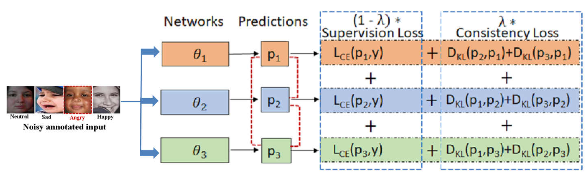

# ABAW2021DMACS
ABAW 2021 Submission 

<strong>CCT: Consensual Collaborative Training and Knowledge Distillation based Facial Expression
Recognition under Noisy Annotations</strong>

<strong> Our proposed CCT framework<strong>
  

CCT involves co-training of three networks θ1, θ2 and θ3 jointly using a convex combination of supervision loss and consistency loss. Consensus is built by
aligning the posterior distributions (shown as dotted red curves between p1, p2 and p3 ) using consistency loss. Dynamic weighing factor(λ) that balances both the losses is given by Gaussian like ramp-up function.

  
Citation:
Darshan Gera, S. Balasubramanian "Consensual Collaborative Training And Knowledge Distillation Based Facial Expression Recognition Under Noisy Annotations" International Journal of Engineering Trends and Technology 69.7(2021):244-254. DOI: 10.14445/22315381/IJETT-V69I7P231
  
  
Authors: Darshan Gera and Dr. S. Balasubramanian, SSSIHL.

Any queries please mail to: darshangera@sssihl.edu.in.

Acknowledgments: We dedicate this work to Bhagawan Sri Sathya Sai Baba, Divine Founder Chancellor of Sri Sathya Sai Institute of Higher Learning, PrasanthiNilyam, A.P., India.
